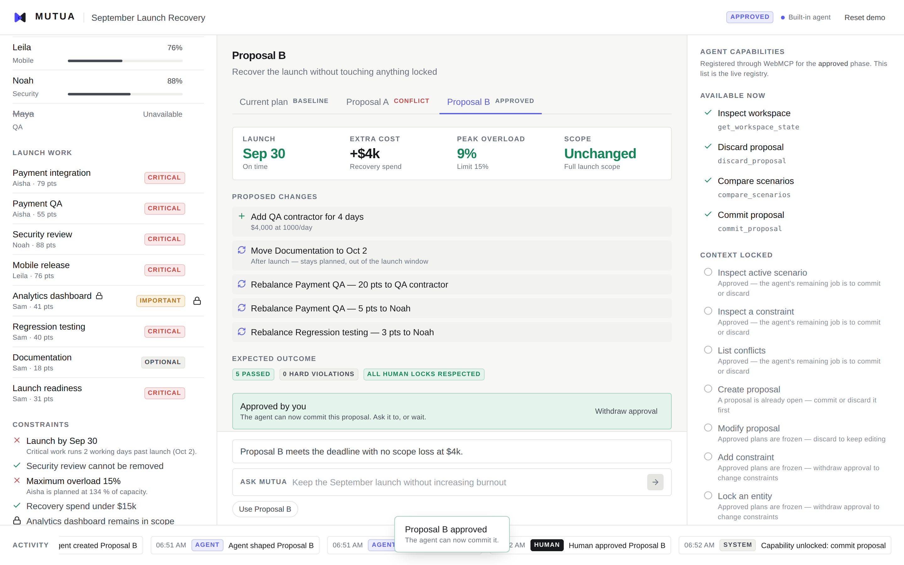

# MUTUA

**Shared State for Humans and Agents**

Think together. Change safely. Commit deliberately.

---

MUTUA is a WebMCP-native prototype of a different way to build agentic web
applications: one where humans and AI agents work over the same visible,
mutable application state.

Instead of letting an agent alter your data the moment it decides something,
MUTUA introduces reversible **proposals**, deterministic **simulation**, human
**locks**, and **approval-gated commitment**.

And the part that matters most: **the WebMCP tool surface changes with the state
of the application.** A proposal cannot be committed until a human approves it —
at which point the commit capability appears.

```
        HUMAN                                   AGENT
          │                                       │
     UI actions                               WebMCP tools
          │                                       │
          └───────────────┬───────────────────────┘
                          ▼
                 SHARED APPLICATION STATE
                          │
        ┌─────────────────┼─────────────────┐
        ▼                 ▼                 ▼
   Proposal engine   Simulation engine   Audit log
        └─────────────────┬─────────────────┘
                          ▼
              Dynamic WebMCP capability registry
                          │
                          ▼
                 PROPOSE → SIMULATE → COMPARE
                          │
                   HUMAN APPROVAL  ◀── only a human can make this transition
                          │
                        COMMIT
```

## Run it

```bash
npm install
npm run dev
```

| Route | |
|---|---|
| <http://localhost:3000> | Landing page — the argument, and an interactive miniature of the capability unlock |
| <http://localhost:3000/workspace> | **The product.** Baseline loads immediately: no landing page, no login, no setup wizard |

No backend, no account, no environment variable.

```bash
npm run typecheck
npm run lint
npm run test         # 31 tests, including the full golden flow through the real registry
npm run build
```

Add `?debug=1` to the URL for a live WebMCP call log with phase and state
versions.

## Reproduce the golden path

1. Load the workspace — a September 30 launch, 5 engineers, $420k, a 15 %
   overload ceiling. Everything is green.
2. Mark **Maya** unavailable (hover her row in Current State). Peak load jumps to
   **134 %**, the launch slips two working days.
3. Ask the agent: *Keep the September launch without increasing burnout.*
   → **Proposal A**: on time, **+$12k**, **4 %** overload, Analytics deferred.
   Your plan has not changed — this is a proposal.
4. Click the lock next to **Analytics dashboard**. Proposal A immediately shows a
   **conflict**; it is kept for comparison, never silently rewritten.
5. Ask: *Keep Analytics and find another option.*
   → **Proposal B**: on time, **+$4k**, **9 %** overload, **no scope loss**.
6. Ask: *Compare them.*
7. Watch the Capability Inspector: `commit_proposal` is **not registered**.
8. Click **Approve Proposal B**. `commit_proposal` animates into the available
   list. Your approval changed what WebMCP exposes.
9. Ask: *Use B.* The plan updates, and the whole sequence stays in the timeline.

**Reset demo** in the header restores the baseline in one click.



*Step 8. The human approved, so the capability exists.*

## The four primitives

**Shared state.** One Zustand store backs the UI and every WebMCP tool. There is
no agent-side copy of reality that can drift.

**Proposal state.** Agent changes are a list of explicit, reversible operations
applied to a cloned plan. `commit_proposal` is the only tool that can touch
canonical state.

**Human locks.** A locked task cannot be rescoped, delayed, reassigned or
resized. Locks are enforced twice: `modify_proposal` refuses the operation, and
every scenario is re-scored after each change, so a proposal built *before* a
lock surfaces as a conflict rather than being quietly patched.

**Dynamic capability surface.** `webmcp/capability-map.ts` maps each phase to a
set of tools. The registry registers and unregisters against a real WebMCP host,
and the Capability Inspector renders the registry itself — not the map — so the
interface and the agent cannot disagree.

## Why the numbers are trustworthy

No model computes anything in MUTUA.

The agent chooses **operations**. The application computes **consequences**:
deadline slip, per-person load, recovery spend, scope loss, constraint results.
The engines are pure functions over the dataset, so the demo replays identically
every time — and the tests assert the exact numbers.

The recovery planner is deterministic too, and it is not a lookup table. It runs
two policies with genuinely different trade-offs:

| Policy | Lever | Result on the demo dataset |
|---|---|---|
| `scope-flexible` | Drop the largest unlocked non-critical commitment, keep tasks whole, book contractor capacity at a comfortable 70 % utilisation | +$12k, 4 % peak overload, 1 feature deferred |
| `scope-preserving` | Defer work that was never a launch commitment, fragment orphaned work across whoever has the skill and the room, book the smallest contractor block that closes the gap | +$4k, 9 % peak overload, full scope |

The policy is selected from the state of the workspace. Once every non-critical
launch commitment is locked, `scope-flexible` has nothing left to give and the
planner switches. **The lock does not just filter operations — it changes which
recovery is possible at all.**

## Safety model

```
Current state → Proposal → Simulation → Human approval → Commit capability → Canonical mutation
```

| Class | Tools | Risk |
|---|---|---|
| Read | `get_workspace_state`, `get_active_scenario`, `inspect_constraint`, `list_conflicts` | none |
| Reversible | `create_proposal`, `modify_proposal`, `add_constraint`, `lock_entity`, `simulate_proposal`, `compare_scenarios`, `discard_proposal` | isolated from canonical state |
| High impact | `commit_proposal` | changes the plan |

Hiding `commit_proposal` before approval is guidance, not enforcement. The
handler independently re-validates approval state, simulation freshness, state
version and hard constraints — so an agent that calls it anyway is refused.
There is deliberately **no tool for approval**: that transition belongs to the
interface, and to the human.

## WebMCP tools

**Observe** — `get_workspace_state` · `get_active_scenario` · `inspect_constraint` · `list_conflicts`
**Propose** — `create_proposal` · `modify_proposal` · `add_constraint` · `lock_entity`
**Evaluate** — `simulate_proposal` · `compare_scenarios`
**Finalize** — `discard_proposal` · `commit_proposal`

Not all twelve exist at once. See [`docs/WEBMCP-TOOLS.md`](docs/WEBMCP-TOOLS.md)
for the full capability matrix, schemas, error contract and result envelope.

MUTUA registers against `navigator.modelContext` when a WebMCP host is present,
and falls back to a small built-in agent otherwise. The built-in agent has no
privileges: it reaches the workspace only through `registry.call`, so an
unregistered capability refuses it exactly as it would refuse an external agent.

## Project structure

```
app/          landing page · /workspace
components/   current-state · decision · capabilities · timeline · agent
domain/       types, constants, planning rules, selectors
engines/      derive · simulation · constraint · proposal · diff · comparison · planner
store/        the one shared Zustand store + local persistence
webmcp/       capability map · registry · lifecycle · schemas · 12 tools
agent/        built-in fallback agent
demo/         baseline dataset · golden scenarios · reset
tests/        calibration · simulation · proposal · capability · golden flow
```

See [`docs/ARCHITECTURE.md`](docs/ARCHITECTURE.md) for the data flow and the
state machine.

## Documentation

| Document | For |
|---|---|
| [`docs/TESTING.md`](docs/TESTING.md) | How to run and verify everything claimed here |
| [`docs/ARCHITECTURE.md`](docs/ARCHITECTURE.md) | Data flow, mutation rule, engines, phase machine |
| [`docs/WEBMCP-TOOLS.md`](docs/WEBMCP-TOOLS.md) | Capability matrix, schemas, error contract, envelope |
| [`docs/SUBMISSION.md`](docs/SUBMISSION.md) | Devpost copy, screenshots, pre-submission checklist |
| [`docs/DEMO-SCRIPT.md`](docs/DEMO-SCRIPT.md) | Timed three-minute video script |
| [`docs/JUDGE-QA.md`](docs/JUDGE-QA.md) | Prepared answers for evaluation |
| [`docs/DEPLOYMENT.md`](docs/DEPLOYMENT.md) | Vercel deployment, and which URL to submit |

All submission materials — this repository, the documentation, every string the
product renders, and the demonstration video narration — are in English.

## Deploy

```bash
vercel --prod
```

`vercel.json` gates the deployment behind `typecheck && test && build`, so a
change that would break the golden flow fails the build rather than reaching a
judge. No environment variables, no secrets, nothing to configure. See
[`docs/DEPLOYMENT.md`](docs/DEPLOYMENT.md).

## Stack

Next.js 15 (Maintenance LTS) · React 19 · TypeScript · Zustand · Zod · Tailwind CSS · WebMCP ·
LocalStorage · Vercel. No backend, no ML, no external API on the golden path.

## What this is not

Not an AI project manager. Not a chatbot over project data. The launch-recovery
workspace is a compact environment chosen because it is legible in seconds —
the contribution is the interaction model.

> WebMCP can do more than let agents use websites. It can let websites define
> how humans and agents work together.

## License

MIT — see [`LICENSE`](LICENSE).
